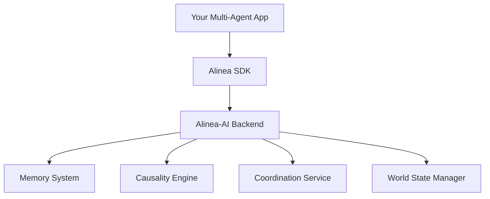

# 🚀 Alinea SDK for Python

**Memory-First Coordination SDK for Multi-Agent Systems**

[](https://www.python.org/downloads/)
[](https://opensource.org/licenses/MIT)
[]()

Connect your multi-agent systems to the powerful Alinea-AI backend for **memory-first coordination**, **real-time causality analysis**, and **intelligent agent orchestration**.

## ✨ **Key Features**

🧠 **Memory-First Coordination** - Agents learn from experience and coordinate intelligently  
🔍 **Real-Time Causality Analysis** - Trace agent interactions and debug complex behaviors  
⚡ **Multi-Agent Orchestration** - Coordinate multiple agents with conflict resolution  
🌍 **Shared World State** - Consistent state management across distributed agents  
🔒 **Secure Authentication** - Enterprise-grade API key authentication  
📊 **Temporal Learning** - Pattern recognition and adaptation over time  

## 🚀 **Quick Start**

### 1. Installation

```bash
git clone https://github.com/your-org/alinea-sdk-python.git
cd alinea-sdk-python
pip install -e .
```

### 2. Environment Setup

```bash
# Copy environment template
cp env.example .env

# Edit .env with your settings
ALINEA_API_KEY=your_secure_api_key_here
ALINEA_BASE_URL=http://localhost:8000
```

### 3. Basic Usage

```python
import os
from alinea.real_client import RealAlineaClient

# Initialize client
client = RealAlineaClient(
    base_url="http://localhost:8000",
    api_key=os.getenv("ALINEA_API_KEY")
)

# Memory-first coordination
intention = await client.intend(
    agent_id="agent_1",
    action="process_data",
    affected_resources=["database", "cache"],
    context={"priority": "high"}
)

result = await client.act(intention)
print(f"Action result: {result.outcome}")

# Causality analysis
causal_path = await client.trace_causality("agent_failure_event")
print(f"Found {len(causal_path.path)} causal steps")
```

## 📚 **Core API Reference**

### Memory-First Coordination

```python
# Declare intention
intention = await client.intend(agent_id, action, resources, context)

# Execute action
result = await client.act(intention)
```

### Causality & Debugging

```python
# Trace causal relationships
causal_path = await client.trace_causality("target_event")

# Analyze impact propagation
impact = await client.analyze_impact("source_change")

# What-if analysis
counterfactual = await client.counterfactual_analysis("event", timestamp)
```

### Multi-Agent Coordination

```python
# Traditional resource coordination
transaction = await client.coordinate(
    agent_id="agent_1",
    resources=["database", "api_service"],
    timeout_ms=30000
)
```

### Learning & Adaptation

```python
# Get pattern confidence
confidence = await client.get_pattern_confidence("pattern_id")

# Check adaptation metrics
metrics = await client.get_adaptation_metrics()
```

## 🏗️ **Architecture**



**Data Flow:**
```
Agent Actions → SDK → Backend APIs → Intelligent Coordination → Results
```

## 📖 **Examples**

### Simple Agent

```python
import asyncio
from alinea.real_client import RealAlineaClient

async def simple_agent():
    client = RealAlineaClient(api_key=os.getenv("ALINEA_API_KEY"))
    
    # Agent workflow
    intention = await client.intend(
        agent_id="simple_agent",
        action="analyze_data",
        affected_resources=["data_store"],
        context={"dataset": "user_behavior"}
    )
    
    result = await client.act(intention)
    return result

# Run agent
result = asyncio.run(simple_agent())
```

### Multi-Agent Trading System

```python
# See examples/real_backend_demo.py for complete implementation
```

## 🔐 **Security Best Practices**

### Environment Variables

**Required Environment Variables:**
```bash
ALINEA_API_KEY=alinea_sk_your_secure_32_char_key_here
ALINEA_BASE_URL=http://localhost:8000
```

### API Key Management

```python
# ✅ SECURE - Use environment variables
api_key = os.getenv("ALINEA_API_KEY")

# ❌ NEVER - Hardcode API keys
api_key = "alinea_sk_hardcoded_key"  # DON'T DO THIS!
```

### .gitignore Setup

The repository includes a comprehensive `.gitignore` that prevents committing:
- `.env` files
- API keys
- Temporary files
- Database files

## 📁 **Project Structure**

```
alinea-sdk-python/
├── alinea/                    # Core SDK package
│   ├── real_client.py        # Production client
│   ├── models.py             # Data models
│   ├── exceptions.py         # Custom exceptions
│   └── ...
├── examples/                 # Usage examples
│   ├── quickstart.py         # Simple example
│   ├── real_backend_demo.py  # Complete demo
│   └── demo_with_mock_backend.py
├── tests/                    # Test cases
├── scripts/                  # Utility scripts
├── .gitignore               # Security-focused
├── env.example              # Environment template
└── README.md                # This file
```

## 🛠️ **Development Setup**

### Prerequisites

- Python 3.8+
- Access to Alinea-AI backend
- Valid API key

### Running Examples

```bash
# Set environment variables
export ALINEA_API_KEY=your_api_key_here

# Run quickstart
python examples/quickstart.py

# Run full backend demo
python examples/real_backend_demo.py

# Run with mock backend (for testing)
python examples/demo_with_mock_backend.py
```

### Testing Connection

```bash
# Test authentication and basic connectivity
python examples/real_backend_test.py
```

## 🐛 **Troubleshooting**

### Common Issues

**Connection Refused:**
```
❌ Cannot connect to host localhost:8000
```
**Solution:** Ensure your Alinea-AI backend is running on localhost:8000

**Authentication Failed:**
```
❌ Authentication failed. Check your API key.
```
**Solution:** Verify your `ALINEA_API_KEY` environment variable is set correctly

**Import Errors:**
```
ModuleNotFoundError: No module named 'alinea'
```
**Solution:** Install the SDK with `pip install -e .` from the project root

## 🤝 **Contributing**

1. Fork the repository
2. Create your feature branch (`git checkout -b feature/amazing-feature`)
3. Commit your changes (`git commit -m 'Add amazing feature'`)
4. Push to the branch (`git push origin feature/amazing-feature`)
5. Open a Pull Request

## 📄 **License**

This project is licensed under the MIT License - see the [LICENSE](LICENSE) file for details.

## 🔗 **Related Projects**

- [Alinea-AI Backend](https://github.com/your-org/alinea-ai) - The backend service
- [Alinea Documentation](https://docs.alinea.ai) - Complete documentation

## 📞 **Support**

- 📧 Email: support@alinea.ai
- 💬 Discord: [Alinea Community](https://discord.gg/alinea)
- 📚 Docs: [docs.alinea.ai](https://docs.alinea.ai)

---

**Built with ❤️ for the multi-agent future** 🤖✨
